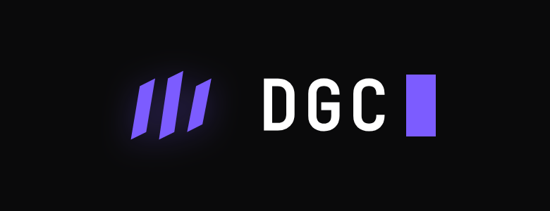
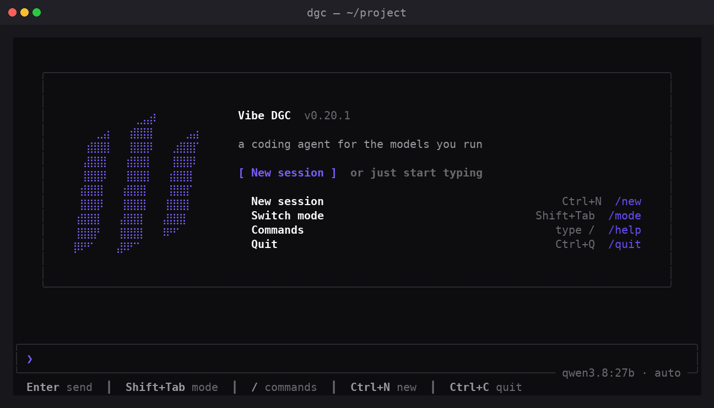
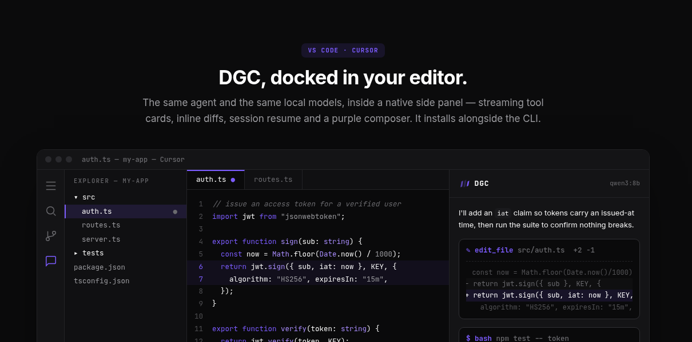

<div align="center">



# Vibe DGC

**A coding-agent CLI for the models *you* run** — the same `///` you see in the terminal.
Built by Mohit Kalra.

</div>

---

DGC is an interactive coding agent that lives in your terminal, pointed at **your own model, on your own machine**: Ollama, llama.cpp, LM Studio, vLLM, or any OpenAI-compatible cloud endpoint (OpenAI, OpenRouter, Groq, DeepSeek, Together, Mistral…).



<sub>The welcome screen, pointed at your own local model — the `///` mark, the session menu, and the **mode · model** status line.</sub>

Pure Python 3.10+, three dependencies (`rich`, `prompt_toolkit`, `requests`). Your code and your prompts never leave your machine unless the model you pick is a cloud one.



<sub>The same agent and local models inside a native editor side panel — streaming tool cards, inline diffs, session resume. Installs alongside the CLI ([VS Code · Cursor](https://vibedgc.com)).</sub>

## Install

One line — nothing needs root:

```bash
curl -fsSL https://vibedgc.com/install.sh | bash
```

Then point it at a model and go:

```bash
dgc setup     # pick a provider + model, interactively
dgc doctor    # check it can reach your model
dgc           # start the interactive agent
```

<sub>Prefer to do it by hand? See [Manual install](#manual-install). Want your own coding agent to set it up? See [Let your agent install it](#let-your-agent-install-it).</sub>

## Connect any model in one command

`dgc setup` walks you through these with **arrow-key menus** (↑/↓ or j/k · enter · esc to go back) — as do `/connect`, `/models`, `/search` and `/resume` inside the REPL:

| Preset | Endpoint | Notes |
|---|---|---|
| `ollama` | `localhost:11434/v1` | local, default |
| `llamacpp` | `localhost:8080/v1` | `llama-server` from llama.cpp |
| `lmstudio` | `localhost:1234/v1` | LM Studio |
| `vllm` | `localhost:8000/v1` | vLLM |
| `openai` | `api.openai.com` | prompts for API key |
| `openrouter` | `openrouter.ai` | 100s of models, one key |
| `groq` · `deepseek` · `together` · `mistral` | — | cloud, prompt for key |

```
/connect ollama
/connect openrouter sk-or-...
/models                 # list what the endpoint serves
/model qwen3.6:27b-q8_0
```

## Permission modes

Switch live with `/mode` (cycles) or `/mode <name>`, or launch with `--mode`:

| Mode | Behavior |
|---|---|
| `default` | reads & known-safe commands auto-run; **writes and other commands ask** |
| `acceptEdits` | **file edits auto-approved**; shell commands still ask |
| `plan` | **read-only** — the agent researches and proposes a plan you approve |
| `auto` | **full-auto** — everything approved, the agent works unattended until done |

Fine-grained rules on top (evaluated deny → ask → allow):

```
/permissions allow Bash(npm run *)
/permissions allow Edit(src/**)
/permissions deny  Bash(rm -rf *)
/permissions deny  Read(**/.env)
```

Approval prompts always offer **allow once / always allow (saves a rule) / deny**.

## What's in the box

- **Multiple agents at once** — run a **fleet**: `Ctrl+N` spawns a new agent (even while one is running), `Ctrl+O` cycles, `Ctrl+\` opens the **dashboard** — every agent with its live state (● on screen · ⋮ working · ◆ needs you · ○ idle), where you attach, close, pin, and rename. A background agent that finishes or needs a decision flags itself in the bottom bar. Each agent can use a different model/endpoint.
- **Interactive REPL** — streaming output, live tool-call display, diffs, todos, a highlighted prompt band, collapsible thinking sections, a per-phase status timer (`Thinking… 0.4s`), a top-right context-window meter (click it for a usage breakdown), and centered dialogs.
- **Plan mode** — read-only research → `present_plan` → approve into auto/acceptEdits/default (like ExitPlanMode). The plan is **saved to a `plan.md` beside the session**; reopen it any time with `/view-plan`.
- **Artifacts** — how the agent proposes something visual on a localhost URL, most often a **plan**: in plan mode DGC renders `plan.md` as a clean page and offers to open it. It also serves any page/app/chart the agent builds. Every artifact shares **one local server on one port** (`127.0.0.1:45000` by default) with a **dropdown, top-left**, to switch between them. The list is **saved**, so it survives a `dgc` restart (`artifact_port` / `artifact_autostart` to tune). `/artifact` lists them; frontends follow the built-in **`dgc-design`** language, so they look intentional by default.
- **In-app docs** — `/docs` opens a searchable how-to library right in the terminal (getting started, shortcuts, plan mode, artifacts, MCP, skills, sessions…), each page a scrollable reader.
- **Next-prompt suggestions** — after each turn DGC predicts a sensible follow-up as ghost text; press **Tab / →** to accept it (toggle with the `suggest` config).
- **Runs tiny local models** — if the endpoint has no native tool-calling, DGC auto-switches to a text tool-call protocol and parses it.
- **Auto context compaction** — near ~85% of your model's context window (configurable via `compact_threshold`), older turns are summarized so long sessions don't overflow. `/compact` forces it.
- **Thinking modes** — `/think off|low|medium|high`; `think` / `think hard` / `ultrathink` in a prompt bump it for that turn. `<think>` streams dim.
- **Memory** — `DGC.md` in your project (and `~/.dgc/DGC.md` personal) load into every session; `#a fact` quick-adds; `/init` writes a project guide.
- **Web search** — the model gets a `web_search` tool. DuckDuckGo works keyless out of the box; add Brave/Tavily (API key) or SearXNG (self-hosted URL) via `dgc setup` or `/search`.
- **Session persistence** — every conversation is saved per project; `dgc --continue` resumes the most recent, `dgc --resume` picks one.
- **Checkpoints & rewind** — every turn is checkpointed; `/rewind` restores both your code and the conversation to an earlier turn.
- **Self-update** — `dgc` checks for a newer version and flags it in the banner; `dgc update` installs it.
- **Skills** — ships **11 built-in skills** (`code-review`, `debug`, `deep-research`, `doctor`, `verify`, `batch`, `dataviz`, `loop`, `fewer-permission-prompts`, `providers`, `dgc-design`) plus your own: drop a `SKILL.md` in `.dgc/skills/<name>/` or `~/.dgc/skills/`, and the model invokes it when the description matches (project overrides user overrides bundled). Run one directly with the `skill` tool or `/skill NAME`. `dgc-design` encodes DGC's frontend design language and stays off for normal coding — artifacts load it automatically.
- **Sub-agents** — the `task` tool hands a self-contained job to a fresh autonomous sub-agent (its own context, the same tools). Sub-agents can run on a *different* local model/host than the main loop — set `subagent_model` / `subagent_base_url` / `subagent_api_key` globally, or define named agents in `.dgc/agents/<name>.md` (frontmatter: name, description, model, base_url, api_key, effort) and pick one with the task tool's `agent` argument. `/agents` lists them; `/subagent` sets the defaults.
- **MCP servers** — connect stdio MCP servers (configured in `~/.dgc/config.json` → `mcp_servers`) and their tools join DGC's own; `/mcp` lists what's connected.
- **Lifecycle hooks** — run your own shell commands on `PreToolUse` / `PostToolUse` / `UserPromptSubmit` (config → `hooks`).
- **Vision input** — attach an image with `@path/to/image.png` for models that can see.
- **Model fallback** — set `fallback_model` (and optional `fallback_base_url`) and DGC retries there if the primary model errors.
- **Custom slash-commands** — drop a Markdown prompt template in `.dgc/commands/*.md` and call it as `/name`.
- **Editor & ACP integration** — `dgc serve` backs the VS Code / Cursor extension; `dgc acp` speaks the Agent Client Protocol (JSON-RPC over stdio) for Zed, Neovim and other ACP clients.
- **Mid-turn queueing** — type a follow-up while a turn runs to queue it, or press Esc to interrupt.
- **Tools** — `read_file` · `write_file` · `edit_file` · `bash` · `bash_output` · `bash_kill` · `glob` · `grep` · `web_fetch` · `web_search` · `todo` · `skill` · `add_skill` · `task` · `artifact` · `save_memory` · `present_plan` · `propose_options`.

## REPL conveniences

```
just type            ask DGC — it uses tools to act on your project
#fact                quick-add a memory to DGC.md
!cmd                 run a shell command directly
@path/to/file        attach a file's contents to your message
Tab / →              accept the ghost-text next-prompt suggestion
/help                every command      ·  /keys  keyboard cheatsheet
/docs                in-app how-to guides
/artifact            open / stop localhost artifact previews
/view-plan           reopen the plan saved in plan mode
/dashboard           session roster — open, switch, start, or delete sessions
```

## Commands

```
dgc                  interactive REPL
dgc setup            configure provider / model / context / web search
dgc doctor           verify the endpoint + model
dgc -c / --continue  resume the most recent session in this directory
dgc --resume         pick a past session to resume
dgc update           update DGC to the latest version
dgc serve            headless JSON backend (NDJSON over stdio) for editor extensions
dgc acp              Agent Client Protocol backend (stdio) for Zed / Neovim / …
dgc -p "fix the bug in auth.py" --mode auto    one-shot, non-interactive
dgc --model NAME --base-url URL --api-key KEY   override + persist
```

## Manual install

```bash
git clone <your-repo-or-tarball> dgc && cd dgc
python3 -m venv .venv && .venv/bin/pip install -e .
.venv/bin/dgc setup
# optional: ln -sf "$PWD/.venv/bin/dgc" ~/.local/bin/dgc
```

## Let your agent install it

Paste this to any coding agent:

> Install DGC for me: run `curl -fsSL https://vibedgc.com/install.sh | bash`, then run `dgc setup` and connect it to my local Ollama (or ask me which provider). Verify with `dgc doctor`.

## Configuration

`~/.dgc/config.json` (created on first change):

```json
{
  "base_url": "http://localhost:11434/v1",
  "api_key": "ollama",
  "model": "qwen3:8b",
  "mode": "default",
  "thinking": "off",
  "context_size": 32768,
  "max_turns": 40,
  "bash_timeout": 120,
  "compact_threshold": 0.85,
  "search_provider": "duckduckgo",
  "permissions": {"allow": ["Bash(git status:*)"], "ask": [], "deny": ["Bash(rm -rf *)"]}
}
```

Set `context_size` to your model's real context window — compaction timing depends on it.

## Development

```bash
.venv/bin/python tests/run_tests.py   # units + end-to-end against a mock LLM server
```

See [AGENTS.md](AGENTS.md) for the layout and conventions.

## Security

DGC is a coding agent that runs shell commands and edits files on your machine. Worth knowing:

- **Ask-by-default.** In the shipped `default` mode, reads are automatic but **every file write and shell command asks first**. Only `auto` mode runs unattended — and DGC warns you before entering it. Use `default` / `acceptEdits` for anything you care about.
- **Your model, your machine.** Code and prompts stay local unless you point DGC at a cloud model (then they go to that provider, with your key).
- **Deny-rules** apply in every mode, including auto — add your own hard blocks: `/permissions deny Bash(rm -rf *)`, `/permissions deny Read(**/.env)`.
- **Prompt injection.** Like any coding agent, pointing it at untrusted content (a web page via `web_fetch`, a hostile file) in `auto` mode could trick the model into running commands — `default` mode's approval prompts are the mitigation.
- **The installer** is non-root (touches only `~/.local/bin` and `~/dgc`) and verifies the download against a published SHA-256.

## License

MIT © 2026 Mohit Kalra.
